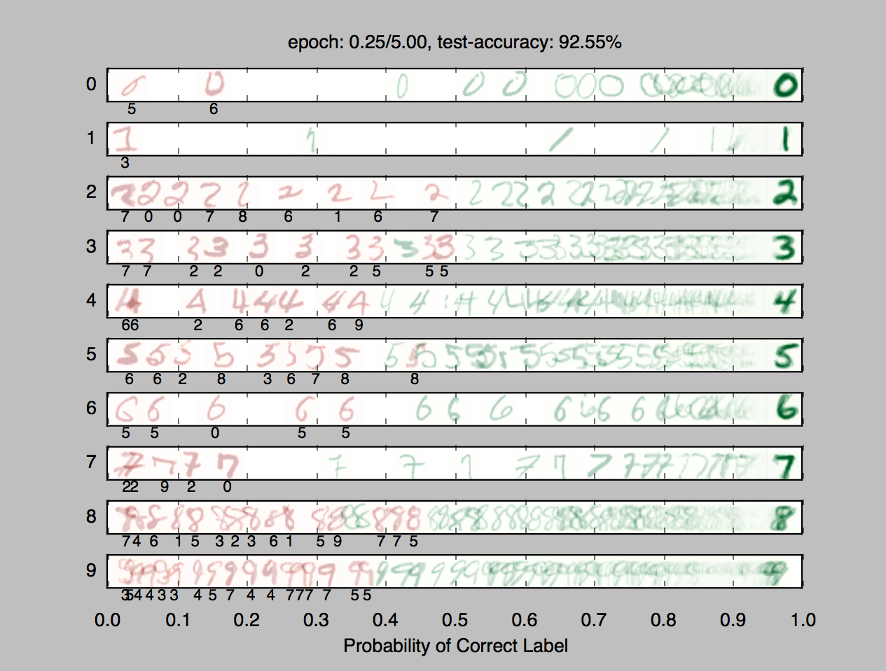
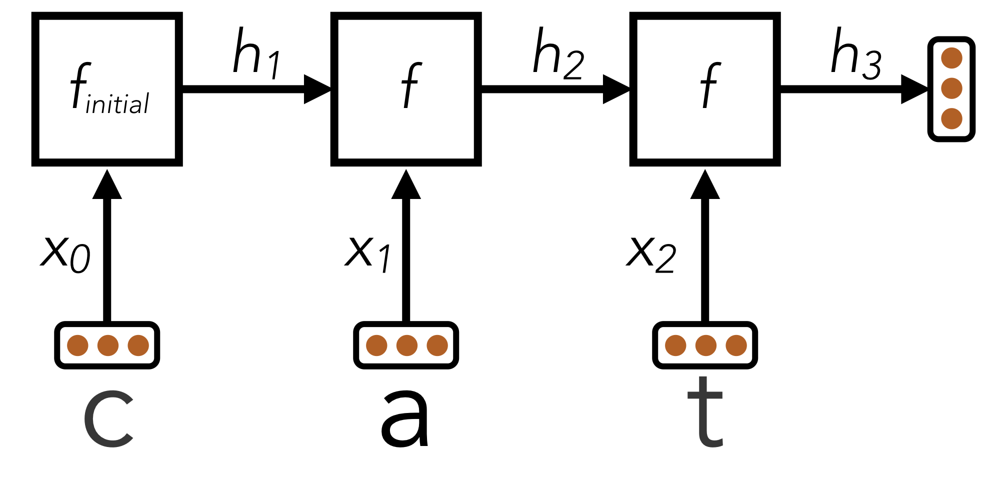

[CSC 665 - Assignment 5: Machine Learning](https://www.pooyanfazli.com/courses/csc665-fall21/assignments/assign5/project5.html)
### CSC 665 - Assignment 5: Machine Learning

Back to [CSC 665 Course Homepage](../../index.html)

**Acknowledgements**: The Pacman AI projects were developed at UC Berkeley. The core projects and autograders were primarily created by John DeNero and Dan Klein. Student side autograding was added by Brad Miller, Nick Hay, and Pieter Abbeel. We thank them for their permission to use it as a part of this course.

* * *

Table of Contents
-----------------

*   [Introduction](#Introduction)
*   [Setup](#Setup)
*   [Provided Code (Part I)](#ProvidedI)
*   [Q1: Perceptron](#Q1)
*   [Neural Network Tips](#Tips)
*   [Provided Code (Part II)](#ProvidedII)
*   [Example: Linear Regression](#LinearRegression)
*   [Q2: (Non-linear) Regression (Not Required)](#Q2)
*   [Q3: Digit Classification (Not Required)](#Q3)
*   [Q4: Language Identification (Not Required)](#Q4)

* * *

In this project you will build a neural network to classify digits, and more!

Introduction
------------

This project will be an introduction to machine learning.

The code for this project contains the following files, available as a [zip archive](machinelearning.zip).

**Files you'll edit:**

`models.py`

Perceptron and neural network models for a variety of applications

**Files you should read but NOT edit:**

`nn.py`

Neural network mini-library

**Files you will not edit:**

`autograder.py`

Project autograder

`backend.py`

Backend code for various machine learning tasks

`data`

Datasets for digit classification and language identification

`submission_autograder.py`

Submission autograder (generates tokens for submission)

**Files to Edit and Submit:** You will fill in portions of `models.py` during the assignment. Please _do not_ change the other files in this distribution.

**Evaluation:** Your code will be autograded for technical correctness. Please _do not_ change the names of any provided functions or classes within the code, or you will wreak havoc on the autograder. However, the correctness of your implementation -- not the autograder's judgements -- will be the final judge of your score. If necessary, we will review and grade assignments individually to ensure that you receive due credit for your work.

**Academic Dishonesty:** We will be checking your code against other submissions in the class for logical redundancy. If you copy someone else's code and submit it with minor changes, we will know. These cheat detectors are quite hard to fool, so please don't try. We trust you all to submit your own work only; _please_ don't let us down. If you do, we will pursue the strongest consequences available to us.

**Proper Dataset Use:** Part of your score for this project will depend on how well the models you train perform on the test set included with the autograder. We do not provide any APIs for you to access the test set directly. Any attempts to bypass this separation or to use the testing data during training will be considered cheating.

**Getting Help:** You are not alone! If you find yourself stuck on something, contact the course staff for help. Office hours and the discussion forum are there for your support; please use them. If you can't make our office hours, let us know and we will schedule more. We want these projects to be rewarding and instructional, not frustrating and demoralizing. But, we don't know when or how to help unless you ask.

**Discussion:** Please be careful not to post spoilers.

* * *

Installation
------------

For this project, you will need to install the following two libraries:

*   `[numpy](http://www.numpy.org/)`, which provides support for large multi-dimensional arrays - [installation instructions](https://docs.scipy.org/doc/numpy-1.13.0/user/install.html)
*   `[matplotlib](https://matplotlib.org/)`, a 2D plotting library - [installation instructions](https://matplotlib.org/users/installing.html)

You will not be using these libraries directly, but they are required in order to run the provided code and autograder.

To test that everything has been installed, run:

python autograder.py --check-dependencies

If `numpy` and `matplotlib` are installed correctly, you should see a window pop up where a line segment spins in a circle:

* * *

### Provided Code (Part I)

For this project, you have been provided with a neural network mini-library (`nn.py`) and a collection of datasets (`backend.py`).

The library in `nn.py` defines a collection of node objects. Each node represents a real number or a matrix of real numbers. Operations on Node objects are optimized to work faster than using Python's built-in types (such as lists).

Here are a few of the provided node types:

*   `nn.Constant` represents a matrix (2D array) of floating point numbers. It is typically used to represent input features or target outputs/labels. Instances of this type will be provided to you by other functions in the API; you will not need to construct them directly
*   `nn.Parameter` represents a trainable parameter of a perceptron or neural network
*   `nn.DotProduct` computes a dot product between its inputs

Additional provided functions:

*   `nn.as_scalar` can extract a Python floating-point number from a node.

When training a perceptron or neural network, you will be passed a `dataset` object. You can retrieve batches of training examples by calling `dataset.iterate_once(batch_size)`:

    for x, y in dataset.iterate_once(batch_size):
        ...

For example, let's extract a batch of size 1 (i.e. a single training example) from the perceptron training data:

    >>> batch_size = 1
    >>> for x, y in dataset.iterate_once(batch_size):
    ...     print(x)
    ...     print(y)
    ...     break
    ...
    <Constant shape=1x3 at 0x11a8856a0>
    <Constant shape=1x1 at 0x11a89efd0>

The input features `x` and the correct label `y` are provided in the form of `nn.Constant` nodes. The shape of `x` will be `batch_size`x`num_features`, and the shape of `y` is `batch_size`x`num_outputs`. Here is an example of computing a dot product of `x` with itself, first as a node and then as a Python number.

    >>> nn.DotProduct(x, x)
    <DotProduct shape=1x1 at 0x11a89edd8>
    >>> nn.as_scalar(nn.DotProduct(x, x))
    1.9756581717465536

* * *

### Question 1 (6 points): Perceptron

_Before starting this part, be sure you have `numpy` and `matplotlib` installed!_

In this part, you will implement a binary perceptron. Your task will be to complete the implementation of the `PerceptronModel` class in `models.py`.

For the perceptron, the output labels will be either 111 or −1−1\-1, meaning that data points `(x, y)` from the dataset will have `y` be a `nn.Constant` node that contains either 111 or −1−1\-1 as its entries.

We have already initialized the perceptron weights `self.w` to be a `1`x`dimensions` parameter node. The provided code will include a bias feature inside `x` when needed, so you will not need a separate parameter for the bias.

Your tasks are to:

*   Implement the `run(self, x)` method. This should compute the dot product of the stored weight vector and the given input, returning an `nn.DotProduct` object.
*   Implement `get_prediction(self, x)`, which should return 111 if the dot product is non-negative or −1−1\-1 otherwise. You should use `nn.as_scalar` to convert a scalar `Node` into a Python floating-point number.
*   Write the `train(self)` method. This should repeatedly loop over the data set and make updates on examples that are misclassified. Use the `update` method of the `nn.Parameter` class to update the weights. When an entire pass over the data set is completed without making any mistakes, 100% training accuracy has been achieved, and training can terminate.

In this project, the only way to change the value of a parameter is by calling `parameter.update(direction, multiplier)`, which will perform the update to the weights:

    weights←weights+direction⋅multiplier

To test your implementation, run the autograder:

    python autograder.py -q q1

**Note:** the autograder should take at most 20 seconds or so to run for a correct implementation. If the autograder is taking forever to run, your code probably has a bug.

* * *

### Neural Network Tips

In the remaining parts of the project, you will implement the following models:

*   Q2: Regression
*   Q3: Handwritten Digit Classification
*   Q4: Language Identification

#### Building Neural Nets

Throughout the applications portion of the project, you'll use the framework provided in `nn.py` to create neural networks to solve a variety of machine learning problems. A simple neural network has layers, where each layer performs a linear operation (just like perceptron). Layers are separated by a _non-linearity_, which allows the network to approximate general functions. We'll use the ReLU operation for our non-linearity, defined as relu(x)\=max(x,0)relu(x)\=max(x,0)relu(x) = \\max(x, 0). For example, a simple two-layer neural network for mapping an input row vector xx\\mathbf{x} to an output vector f(x)f(x)\\mathbf{f}(\\mathbf{x}) would be given by the function:  

<mrow class=&quot;MJX-TeXAtom-ORD&quot;><mi mathvariant=&quot;bold&quot;>f</mi></mrow><mo stretchy=&quot;false&quot;>(</mo><mrow class=&quot;MJX-TeXAtom-ORD&quot;><mi mathvariant=&quot;bold&quot;>x</mi></mrow><mo stretchy=&quot;false&quot;>)</mo><mo>=</mo><mi>r</mi><mi>e</mi><mi>l</mi><mi>u</mi><mo stretchy=&quot;false&quot;>(</mo><mrow class=&quot;MJX-TeXAtom-ORD&quot;><mi mathvariant=&quot;bold&quot;>x</mi></mrow><mo>&amp;#x22C5;</mo><mrow class=&quot;MJX-TeXAtom-ORD&quot;><msub><mi mathvariant=&quot;bold&quot;>W</mi><mn mathvariant=&quot;bold&quot;>1</mn></msub></mrow><mo>+</mo><mrow class=&quot;MJX-TeXAtom-ORD&quot;><msub><mi mathvariant=&quot;bold&quot;>b</mi><mn mathvariant=&quot;bold&quot;>1</mn></msub></mrow><mo stretchy=&quot;false&quot;>)</mo><mo>&amp;#x22C5;</mo><mrow class=&quot;MJX-TeXAtom-ORD&quot;><msub><mi mathvariant=&quot;bold&quot;>W</mi><mn mathvariant=&quot;bold&quot;>2</mn></msub></mrow><mo>+</mo><msub><mrow class=&quot;MJX-TeXAtom-ORD&quot;><mi mathvariant=&quot;bold&quot;>b</mi></mrow><mn>2</mn></msub></math>" role="presentation"><nobr aria-hidden="true">f(x)=relu(x⋅W1+b1)⋅W2+b2</nobr><math xmlns="http://www.w3.org/1998/Math/MathML" display="block"><mrow class="MJX-TeXAtom-ORD"><mi mathvariant="bold">f</mi></mrow><mo stretchy="false">(</mo><mrow class="MJX-TeXAtom-ORD"><mi mathvariant="bold">x</mi></mrow><mo stretchy="false">)</mo><mo>=</mo><mi>r</mi><mi>e</mi><mi>l</mi><mi>u</mi><mo stretchy="false">(</mo><mrow class="MJX-TeXAtom-ORD"><mi mathvariant="bold">x</mi></mrow><mo>⋅</mo><mrow class="MJX-TeXAtom-ORD"><msub><mi mathvariant="bold">W</mi><mn mathvariant="bold">1</mn></msub></mrow><mo>+</mo><mrow class="MJX-TeXAtom-ORD"><msub><mi mathvariant="bold">b</mi><mn mathvariant="bold">1</mn></msub></mrow><mo stretchy="false">)</mo><mo>⋅</mo><mrow class="MJX-TeXAtom-ORD"><msub><mi mathvariant="bold">W</mi><mn mathvariant="bold">2</mn></msub></mrow><mo>+</mo><msub><mrow class="MJX-TeXAtom-ORD"><mi mathvariant="bold">b</mi></mrow><mn>2</mn></msub></math>

We can also create deeper networks by adding more layers, for example a three-layer net:  

<mrow class=&quot;MJX-TeXAtom-ORD&quot;><mi mathvariant=&quot;bold&quot;>f</mi></mrow><mo stretchy=&quot;false&quot;>(</mo><mrow class=&quot;MJX-TeXAtom-ORD&quot;><mi mathvariant=&quot;bold&quot;>x</mi></mrow><mo stretchy=&quot;false&quot;>)</mo><mo>=</mo><mi>r</mi><mi>e</mi><mi>l</mi><mi>u</mi><mo stretchy=&quot;false&quot;>(</mo><mi>r</mi><mi>e</mi><mi>l</mi><mi>u</mi><mo stretchy=&quot;false&quot;>(</mo><mrow class=&quot;MJX-TeXAtom-ORD&quot;><mi mathvariant=&quot;bold&quot;>x</mi></mrow><mo>&amp;#x22C5;</mo><mrow class=&quot;MJX-TeXAtom-ORD&quot;><msub><mi mathvariant=&quot;bold&quot;>W</mi><mn mathvariant=&quot;bold&quot;>1</mn></msub></mrow><mo>+</mo><mrow class=&quot;MJX-TeXAtom-ORD&quot;><msub><mi mathvariant=&quot;bold&quot;>b</mi><mn mathvariant=&quot;bold&quot;>1</mn></msub></mrow><mo stretchy=&quot;false&quot;>)</mo><mo>&amp;#x22C5;</mo><mrow class=&quot;MJX-TeXAtom-ORD&quot;><msub><mi mathvariant=&quot;bold&quot;>W</mi><mn mathvariant=&quot;bold&quot;>2</mn></msub></mrow><mo>+</mo><msub><mrow class=&quot;MJX-TeXAtom-ORD&quot;><mi mathvariant=&quot;bold&quot;>b</mi></mrow><mn>2</mn></msub><mo stretchy=&quot;false&quot;>)</mo><mo>&amp;#x22C5;</mo><mrow class=&quot;MJX-TeXAtom-ORD&quot;><msub><mi mathvariant=&quot;bold&quot;>W</mi><mn mathvariant=&quot;bold&quot;>3</mn></msub></mrow><mo>+</mo><mrow class=&quot;MJX-TeXAtom-ORD&quot;><msub><mi mathvariant=&quot;bold&quot;>b</mi><mn mathvariant=&quot;bold&quot;>3</mn></msub></mrow></math>" role="presentation"><nobr aria-hidden="true">f(x)=relu(relu(x⋅W1+b1)⋅W2+b2)⋅W3+b3</nobr><math xmlns="http://www.w3.org/1998/Math/MathML" display="block"><mrow class="MJX-TeXAtom-ORD"><mi mathvariant="bold">f</mi></mrow><mo stretchy="false">(</mo><mrow class="MJX-TeXAtom-ORD"><mi mathvariant="bold">x</mi></mrow><mo stretchy="false">)</mo><mo>=</mo><mi>r</mi><mi>e</mi><mi>l</mi><mi>u</mi><mo stretchy="false">(</mo><mi>r</mi><mi>e</mi><mi>l</mi><mi>u</mi><mo stretchy="false">(</mo><mrow class="MJX-TeXAtom-ORD"><mi mathvariant="bold">x</mi></mrow><mo>⋅</mo><mrow class="MJX-TeXAtom-ORD"><msub><mi mathvariant="bold">W</mi><mn mathvariant="bold">1</mn></msub></mrow><mo>+</mo><mrow class="MJX-TeXAtom-ORD"><msub><mi mathvariant="bold">b</mi><mn mathvariant="bold">1</mn></msub></mrow><mo stretchy="false">)</mo><mo>⋅</mo><mrow class="MJX-TeXAtom-ORD"><msub><mi mathvariant="bold">W</mi><mn mathvariant="bold">2</mn></msub></mrow><mo>+</mo><msub><mrow class="MJX-TeXAtom-ORD"><mi mathvariant="bold">b</mi></mrow><mn>2</mn></msub><mo stretchy="false">)</mo><mo>⋅</mo><mrow class="MJX-TeXAtom-ORD"><msub><mi mathvariant="bold">W</mi><mn mathvariant="bold">3</mn></msub></mrow><mo>+</mo><mrow class="MJX-TeXAtom-ORD"><msub><mi mathvariant="bold">b</mi><mn mathvariant="bold">3</mn></msub></mrow></math>

#### Note on Batching

For efficiency, you will be required to process whole batches of data at once rather than a single example at a time. This means that instead of a single input row vector xxx with size iii, you will be presented with a batch of bbb inputs represented as a b×ib×ib \\times i matrix XXX. We provide an example for linear regression to demonstrate how a linear layer can be implemented in the batched setting.

#### Note on Randomness

The parameters of your neural network will be randomly initialized, and data in some tasks will be presented in shuffled order. Due to this randomness, it's possible that you will still occasionally fail some tasks even with a strong architecture -- this is the problem of local optima! This should happen very rarely, though -- if when testing your code you fail the autograder twice in a row for a question, you should explore other architectures.

#### Practical tips

Designing neural nets can take some trial and error. Here are some tips to help you along the way:

*   Be systematic. Keep a log of every architecture you've tried, what the hyperparameters (layer sizes, learning rate, etc.) were, and what the resulting performance was. As you try more things, you can start seeing patterns about which parameters matter. If you find a bug in your code, be sure to cross out past results that are invalid due to the bug.
*   Start with a shallow network (just two layers, i.e. one non-linearity). Deeper networks have exponentially more hyperparameter combinations, and getting even a single one wrong can ruin your performance. Use the small network to find a good learning rate and layer size; afterwards you can consider adding more layers of similar size.
*   If your learning rate is wrong, none of your other hyperparameter choices matter. You can take a state-of-the-art model from a research paper, and change the learning rate such that it performs no better than random.  
    
*   Smaller batches require lower learning rates. When experimenting with different batch sizes, be aware that the best learning rate may be different depending on the batch size.  
    
*   Making the network too wide generally doesn't hurt accuracy too much. If you keep making the network wider accuracy will gradually decline, but computation time will increase quadratically in the layer size -- you're likely to give up due to excessive slowness long before the accuracy falls too much. The full autograder for all parts of the project takes 2-12 minutes to run with staff solutions; if your code is taking much longer you should check it for efficiency.
*   If your model is returning Infinity or NaN, your learning rate is probably too high for your current architecture.
*   Recommended values for your hyperparameters:

*   Hidden layer sizes: between 10 and 400
*   Batch size: between 1 and the size of the dataset. For Q2 and Q3, we require that total size of the dataset be evenly divisible by the batch size.
*   Learning rate: between 0.001 and 1.0
*   Number of hidden layers: between 1 and 3

* * *

### Provided Code (Part II)

Here is a full list of nodes available in `nn.py`. You will make use of these in the remaining parts of the assignment:

*   `nn.Constant` represents a matrix (2D array) of floating point numbers. It is typically used to represent input features or target outputs/labels. Instances of this type will be provided to you by other functions in the API; you will not need to construct them directly
*   `nn.Parameter` represents a trainable parameter of a perceptron or neural network. All parameters must be 2-dimensional.
    *   Usage: `nn.Parameter(n, m)` constructs a parameter with shape n×mn×mn \\times m
*   `nn.Add` adds matrices element-wise
    *   Usage: `nn.Add(x, y)` accepts two nodes of shape `batch_size`x`num_features` and constructs a node that also has shape `batch_size`x`num_features`
*   `nn.AddBias` adds a bias vector to each feature vector
    *   Usage: `nn.AddBias(features, bias)` accepts `features` of shape `batch_size`x`num_features` and `bias` of shape `1`x`num_features`, and constructs a node that has shape `batch_size`x`num_features`.
*   `nn.Linear` applies a linear transformation (matrix multiplication) to the input
    *   Usage: `nn.Linear(features, weights)` accepts `features` of shape `batch_size`x`num_input_features` and `weights` of shape `num_input_features`x`num_output_features`, and constructs a node that has shape `batch_size`x`num_output_features`.
*   `nn.ReLU` applies the element-wise Rectified Linear Unit nonlinearity relu(x)\=max(x,0)relu(x)\=max(x,0)relu(x) = max(x, 0). This nonlinearity replaces all negative entries in its input with zeros.
    *   Usage: `nn.ReLU(features)`, which returns a node with the same shape as the `input`.
*   `nn.SquareLoss` computes a batched square loss, used for regression problems
    *   Usage: `nn.SquareLoss(a, b)`, where `a` and `b` both have shape `batch_size`x`num_outputs`.
*   `nn.SoftmaxLoss` computes a batched softmax loss, used for classification problems
    *   Usage: `nn.SoftmaxLoss(logits, labels)`, where `logits` and `labels` both have shape `batch_size`x`num_classes`. The term "logits" refers to scores produced by a model, where each entry can be an arbitrary real number. The labels, however, must be non-negative and have each row sum to 1. Be sure not to swap the order of the arguments!
*   _Do not use `nn.DotProduct` for any model other than the perceptron_

The following methods are available in `nn.py`:

*   `nn.gradients` computes gradients of a loss with respect to provided parameters.
    *   Usage: `nn.gradients(loss, [parameter_1, parameter_2, ..., parameter_n])` will return a list `[gradient_1, gradient_2, ..., gradient_n]`, where each element is an `nn.Constant` containing the gradient of the loss with respect to a parameter.
*   `nn.as_scalar` can extract a Python floating-point number from a loss node. This can be useful to determine when to stop training.
    *   Usage: `nn.as_scalar(node)`, where `node` is either a loss node or has shape 1×11×11 \\times 1.

The datasets provided also have two additional methods:

*   `dataset.iterate_forever(batch_size)` yields an infinite sequences of batches of examples.
*   `dataset.get_validation_accuracy()` returns the accuracy of your model on the validation set. This can be useful to determine when to stop training.

* * *

### Example: Linear Regression

As an example of how the neural network framework works, let's fit a line to a set of data points. We'll start four points of training data constructed using the function <mi>y</mi><mo>=</mo><mn>7</mn><msub><mi>x</mi><mn>0</mn></msub><mo>+</mo><mn>8</mn><msub><mi>x</mi><mn>1</mn></msub><mo>+</mo><mn>3</mn></math>" role="presentation"><nobr aria-hidden="true">y=7x0+8x1+3</nobr><math xmlns="http://www.w3.org/1998/Math/MathML"><mi>y</mi><mo>=</mo><mn>7</mn><msub><mi>x</mi><mn>0</mn></msub><mo>+</mo><mn>8</mn><msub><mi>x</mi><mn>1</mn></msub><mo>+</mo><mn>3</mn></math> . In batched form, our data is:

Suppose the data is provided to us in the form of `nn.Constant` nodes:

    >>> x
    <Constant shape=4x2 at 0x10a30fe80>
    >>> y
    <Constant shape=4x1 at 0x10a30fef0>

Let's construct and train a model of the form <mi>f</mi><mo stretchy=&quot;false&quot;>(</mo><mi>x</mi><mo stretchy=&quot;false&quot;>)</mo><mo>=</mo><msub><mi>x</mi><mn>0</mn></msub><mo>&amp;#x22C5;</mo><msub><mi>m</mi><mn>0</mn></msub><mo>+</mo><msub><mi>x</mi><mn>1</mn></msub><mo>&amp;#x22C5;</mo><msub><mi>m</mi><mn>1</mn></msub><mo>+</mo><mi>b</mi></math>" role="presentation"><nobr aria-hidden="true">f(x)=x0⋅m0+x1⋅m1+b</nobr><math xmlns="http://www.w3.org/1998/Math/MathML"><mi>f</mi><mo stretchy="false">(</mo><mi>x</mi><mo stretchy="false">)</mo><mo>=</mo><msub><mi>x</mi><mn>0</mn></msub><mo>⋅</mo><msub><mi>m</mi><mn>0</mn></msub><mo>+</mo><msub><mi>x</mi><mn>1</mn></msub><mo>⋅</mo><msub><mi>m</mi><mn>1</mn></msub><mo>+</mo><mi>b</mi></math>. If done correctly, we should be able to learn than <msub><mi>m</mi><mn>0</mn></msub><mo>=</mo><mn>7</mn></math>" role="presentation"><nobr aria-hidden="true">m0=7</nobr><math xmlns="http://www.w3.org/1998/Math/MathML"><msub><mi>m</mi><mn>0</mn></msub><mo>=</mo><mn>7</mn></math>, <msub><mi>m</mi><mn>1</mn></msub><mo>=</mo><mn>8</mn></math>" role="presentation"><nobr aria-hidden="true">m1=8</nobr><math xmlns="http://www.w3.org/1998/Math/MathML"><msub><mi>m</mi><mn>1</mn></msub><mo>=</mo><mn>8</mn></math>, and <mi>b</mi><mo>=</mo><mn>3</mn></math>" role="presentation"><nobr aria-hidden="true">b=3</nobr><math xmlns="http://www.w3.org/1998/Math/MathML"><mi>b</mi><mo>=</mo><mn>3</mn></math>.

First, we create our trainable parameters. In matrix form, these are:

Which corresponds to the following code:

    m = nn.Parameter(2, 1)
    b = nn.Parameter(1, 1)

Printing them gives:

    >>> m
    <Parameter shape=2x1 at 0x112b8b208>
    >>> b
    <Parameter shape=1x1 at 0x112b8beb8>

Next, we compute our model's predictions for y:

    <pre>xm = nn.Linear(x, m)
    predicted_y = nn.AddBias(xm, b)</pre>

Our goal is to have the predicted y-values match the provided data. In linear regression we do this by minimizing the square loss: <mrow class=&quot;MJX-TeXAtom-ORD&quot;><mi class=&quot;MJX-tex-caligraphic&quot; mathvariant=&quot;script&quot;>L</mi></mrow><mo>=</mo><mfrac><mn>1</mn><mrow><mn>2</mn><mi>N</mi></mrow></mfrac><munder><mo>&amp;#x2211;</mo><mrow class=&quot;MJX-TeXAtom-ORD&quot;><mo stretchy=&quot;false&quot;>(</mo><mi>x</mi><mo>,</mo><mi>y</mi><mo stretchy=&quot;false&quot;>)</mo></mrow></munder><mo stretchy=&quot;false&quot;>(</mo><mi>y</mi><mo>&amp;#x2212;</mo><mi>f</mi><mo stretchy=&quot;false&quot;>(</mo><mi>x</mi><mo stretchy=&quot;false&quot;>)</mo><msup><mo stretchy=&quot;false&quot;>)</mo><mn>2</mn></msup></math>" role="presentation"><nobr aria-hidden="true">L=12N∑(x,y)(y−f(x))2</nobr><math xmlns="http://www.w3.org/1998/Math/MathML"><mrow class="MJX-TeXAtom-ORD"><mi class="MJX-tex-caligraphic" mathvariant="script">L</mi></mrow><mo>=</mo><mfrac><mn>1</mn><mrow><mn>2</mn><mi>N</mi></mrow></mfrac><munder><mo>∑</mo><mrow class="MJX-TeXAtom-ORD"><mo stretchy="false">(</mo><mi>x</mi><mo>,</mo><mi>y</mi><mo stretchy="false">)</mo></mrow></munder><mo stretchy="false">(</mo><mi>y</mi><mo>−</mo><mi>f</mi><mo stretchy="false">(</mo><mi>x</mi><mo stretchy="false">)</mo><msup><mo stretchy="false">)</mo><mn>2</mn></msup></math>

We construct a loss node:

    <pre>loss = nn.SquareLoss(predicted_y, y)</pre>

In our framework, we provide a method that will return the gradients of the loss with respect to the parameters:

    <pre>grad_wrt_m, grad_wrt_b = nn.gradients(loss, [m, b])</pre>

Printing the nodes used gives:

    >>> xm
    <Linear shape=4x1 at 0x11a869588>
    >>> predicted\_y
    <AddBias shape=4x1 at 0x11c23aa90>
    >>> loss
    <SquareLoss shape=() at 0x11c23a240>
    >>> grad\_wrt\_m
    <Constant shape=2x1 at 0x11a8cb160>
    >>> grad\_wrt\_b
    <Constant shape=1x1 at 0x11a8cb588>

We can then use the `update` method to update our parameters. Here is an update for `m`, assuming we have already initialized a `multiplier` variable based on a suitable learning rate of our choosing:

    <pre>m.update(grad_wrt_m, multiplier)</pre>

If we also include an update for `b` and add a loop to repeatedly perform gradient updates, we will have the full training procedure for linear regression.

* * *

### Question 2 (Not Required): Non-linear Regression

For this question, you will train a neural network to approximate <mi>sin</mi><mo>&amp;#x2061;</mo><mo stretchy=&quot;false&quot;>(</mo><mi>x</mi><mo stretchy=&quot;false&quot;>)</mo></math>" role="presentation"><nobr aria-hidden="true">sin(x)</nobr><math xmlns="http://www.w3.org/1998/Math/MathML"><mi>sin</mi><mo>⁡</mo><mo stretchy="false">(</mo><mi>x</mi><mo stretchy="false">)</mo></math> over <mo stretchy=&quot;false&quot;>[</mo><mo>&amp;#x2212;</mo><mn>2</mn><mi>&amp;#x03C0;</mi><mo>,</mo><mn>2</mn><mi>&amp;#x03C0;</mi><mo stretchy=&quot;false&quot;>]</mo></math>" role="presentation"><nobr aria-hidden="true">[−2π,2π]</nobr><math xmlns="http://www.w3.org/1998/Math/MathML"><mo stretchy="false">[</mo><mo>−</mo><mn>2</mn><mi>π</mi><mo>,</mo><mn>2</mn><mi>π</mi><mo stretchy="false">]</mo></math>.

You will need to complete the implementation of the `RegressionModel` class in `models.py`. For this problem, a relatively simple architecture should suffice (see [Neural Network Tips](#Tips) for architecture tips.) Use `nn.SquareLoss` as your loss.

Your tasks are to:

*   Implement `RegressionModel.run` to return a `batch_size x 1` node that represents your model's prediction.
*   Implement `RegressionModel.get_loss` to return a loss for given inputs and target outputs.
*   Implement `RegressionModel.train`, which should train your model using gradient-based updates.

There is only a single dataset split for this task, i.e. there is only training data and no validation data or test set. Your implementation will receive full points if it gets a loss of 0.02 or better, averaged across all examples in the dataset. You may use the training loss to determine when to stop training (use `nn.as_scalar` to convert a loss node to a Python number).

    python autograder.py -q q2

* * *

### Question 3 (Not Required): Digit Classification

For this question, you will train a network to classify handwritten digits from the MNIST dataset.

Each digit is of size 28×2828×2828\\times28 pixels, the values of which are stored in a 784784784\-dimensional vector of floating point numbers. Each output we provide is a 10-dimensional vector which has zeros in all positions, except for a one in the position corresponding to the correct class of the digit.

Complete the implementation of the `DigitClassificationModel` class in `models.py`. The return value from `DigitClassificationModel.run()` should be a `batch_size`x`10` node containing scores, where higher scores indicate a higher probability of a digit belonging to a particular class (0-9). You should use `nn.SoftmaxLoss` as your loss.

For both this question and Q4, in addition to training data there is also validation data and a test set. You can use `dataset.get_validation_accuracy()` to compute validation accuracy for your model, which can be useful when deciding whether to stop training. The test set will be used by the autograder.

To receive points for this question, your model should achieve an accuracy of at least 97% on the test set. For reference, our staff implementation consistently achieves an accuracy of 98% on the validation data after training for around 5 epochs.

To test your implementation, run the autograder:

    python autograder.py -q q3

* * *

### Question 4 (Not Required): Language Identification

Language identification is the task of figuring out, given a piece of text, what language the text is written in. For example, your browser might be able to detect if you've visited a page in a foreign language and offer to translate it for you. Here is an example from Chrome (which uses a neural network to implement this feature):

In this project, we're going to build a smaller neural network model that identifies language for one word at a time. Our dataset consists of words in five languages, such as the table below:

<tbody>
              <tr><th>Word</th> <th>Language</th></tr>
              <tr>
                <td>discussed</td>
                <td>English</td>
              </tr>
              <tr>
                <td>eternidad</td>
                <td>Spanish</td>
              </tr>
              <tr>
                <td>itseänne</td>
                <td>Finnish</td>
              </tr>
              <tr>
                <td>paleis</td>
                <td>Dutch</td>
              </tr>
              <tr>
                <td>mieszkać</td>
                <td>Polish</td>
              </tr>
</tbody>

Different words consist of different numbers of letters, so our model needs to have an architecture that can handle variable-length inputs. Instead of a single input <mi>x</mi></math>" role="presentation"><nobr aria-hidden="true">x</nobr><math xmlns="http://www.w3.org/1998/Math/MathML"><mi>x</mi></math> (like in the previous questions), we'll have a separate input for each character in the word: <msub><mi>x</mi><mn>0</mn></msub><mo>,</mo><msub><mi>x</mi><mn>1</mn></msub><mo>,</mo><mo>&amp;#x2026;</mo><mo>,</mo><msub><mi>x</mi><mrow class=&quot;MJX-TeXAtom-ORD&quot;><mi>L</mi><mo>&amp;#x2212;</mo><mn>1</mn></mrow></msub></math>" role="presentation"><nobr aria-hidden="true">x0,x1,…,xL−1</nobr><math xmlns="http://www.w3.org/1998/Math/MathML"><msub><mi>x</mi><mn>0</mn></msub><mo>,</mo><msub><mi>x</mi><mn>1</mn></msub><mo>,</mo><mo>…</mo><mo>,</mo><msub><mi>x</mi><mrow class="MJX-TeXAtom-ORD"><mi>L</mi><mo>−</mo><mn>1</mn></mrow></msub></math> where <mi>L</mi></math>" role="presentation"><nobr aria-hidden="true">L</nobr><math xmlns="http://www.w3.org/1998/Math/MathML"><mi>L</mi></math> is the length of the word. We'll start by applying a network <msub><mi>f</mi><mrow class=&quot;MJX-TeXAtom-ORD&quot;><mtext>initial</mtext></mrow></msub></math>" role="presentation"><nobr aria-hidden="true">finitial</nobr><math xmlns="http://www.w3.org/1998/Math/MathML"><msub><mi>f</mi><mrow class="MJX-TeXAtom-ORD"><mtext>initial</mtext></mrow></msub></math> that is just like the feed-forward networks in the previous problems. It accepts its input <msub><mi>x</mi><mn>0</mn></msub></math>" role="presentation"><nobr aria-hidden="true">x0</nobr><math xmlns="http://www.w3.org/1998/Math/MathML"><msub><mi>x</mi><mn>0</mn></msub></math> and computes an output vector <msub><mi>h</mi><mn>1</mn></msub></math>" role="presentation"><nobr aria-hidden="true">h1</nobr><math xmlns="http://www.w3.org/1998/Math/MathML"><msub><mi>h</mi><mn>1</mn></msub></math> of dimensionality <mi>d</mi></math>" role="presentation"><nobr aria-hidden="true">d</nobr><math xmlns="http://www.w3.org/1998/Math/MathML"><mi>d</mi></math>: 
<msub><mi>h</mi><mn>1</mn></msub><mo>=</mo><msub><mi>f</mi><mrow class=&quot;MJX-TeXAtom-ORD&quot;><mtext>initial</mtext></mrow></msub><mo stretchy=&quot;false&quot;>(</mo><msub><mi>x</mi><mn>0</mn></msub><mo stretchy=&quot;false&quot;>)</mo></math>" role="presentation"><nobr aria-hidden="true">h1=finitial(x0)</nobr><math xmlns="http://www.w3.org/1998/Math/MathML" display="block"><msub><mi>h</mi><mn>1</mn></msub><mo>=</mo><msub><mi>f</mi><mrow class="MJX-TeXAtom-ORD"><mtext>initial</mtext></mrow></msub><mo stretchy="false">(</mo><msub><mi>x</mi><mn>0</mn></msub><mo stretchy="false">)</mo></math>

Next, we'll combine the output of the previous step with the next letter in the word, generating a vector summary of the the first two letters of the word.  To do this, we'll apply a sub-network that accepts a letter and outputs a hidden state, but now also depends on the previous hidden state <msub><mi>h</mi><mn>1</mn></msub></math>" role="presentation"><nobr aria-hidden="true">h1</nobr><math xmlns="http://www.w3.org/1998/Math/MathML"><msub><mi>h</mi><mn>1</mn></msub></math>. We denote this sub-network as <mi>f</mi></math>" role="presentation"><nobr aria-hidden="true">f</nobr><math xmlns="http://www.w3.org/1998/Math/MathML"><mi>f</mi></math>. 
<msub><mi>h</mi><mn>2</mn></msub><mo>=</mo><mi>f</mi><mo stretchy=&quot;false&quot;>(</mo><msub><mi>h</mi><mn>1</mn></msub><mo>,</mo><msub><mi>x</mi><mn>1</mn></msub><mo stretchy=&quot;false&quot;>)</mo></math>" role="presentation"><nobr aria-hidden="true">h2=f(h1,x1)</nobr><math xmlns="http://www.w3.org/1998/Math/MathML" display="block"><msub><mi>h</mi><mn>2</mn></msub><mo>=</mo><mi>f</mi><mo stretchy="false">(</mo><msub><mi>h</mi><mn>1</mn></msub><mo>,</mo><msub><mi>x</mi><mn>1</mn></msub><mo stretchy="false">)</mo></math>

This pattern continues for all letters in the input word, where the hidden state at each step summarizes all the letters the network has processed thus far: 
<msub><mi>h</mi><mn>3</mn></msub><mo>=</mo><mi>f</mi><mo stretchy=&quot;false&quot;>(</mo><msub><mi>h</mi><mn>2</mn></msub><mo>,</mo><msub><mi>x</mi><mn>2</mn></msub><mo stretchy=&quot;false&quot;>)</mo></math>" role="presentation"><nobr aria-hidden="true">h3=f(h2,x2)</nobr><math xmlns="http://www.w3.org/1998/Math/MathML" display="block"><msub><mi>h</mi><mn>3</mn></msub><mo>=</mo><mi>f</mi><mo stretchy="false">(</mo><msub><mi>h</mi><mn>2</mn></msub><mo>,</mo><msub><mi>x</mi><mn>2</mn></msub><mo stretchy="false">)</mo></math>
 
<mo>&amp;#x2026;</mo></math>" role="presentation"><nobr aria-hidden="true">…</nobr><math xmlns="http://www.w3.org/1998/Math/MathML" display="block"><mo>…</mo></math>

Throughout these computations, the function <mi>f</mi><mo stretchy=&quot;false&quot;>(</mo><mo>&amp;#x22C5;</mo><mo>,</mo><mo>&amp;#x22C5;</mo><mo stretchy=&quot;false&quot;>)</mo></math>" role="presentation"><nobr aria-hidden="true">f(⋅,⋅)</nobr><math xmlns="http://www.w3.org/1998/Math/MathML"><mi>f</mi><mo stretchy="false">(</mo><mo>⋅</mo><mo>,</mo><mo>⋅</mo><mo stretchy="false">)</mo></math> is the same piece of neural network and uses the same trainable parameters; <msub><mi>f</mi><mrow class=&quot;MJX-TeXAtom-ORD&quot;><mtext>initial</mtext></mrow></msub></math>" role="presentation"><nobr aria-hidden="true">finitial</nobr><math xmlns="http://www.w3.org/1998/Math/MathML"><msub><mi>f</mi><mrow class="MJX-TeXAtom-ORD"><mtext>initial</mtext></mrow></msub></math> will also share some of the same parameters as <mi>f</mi><mo stretchy=&quot;false&quot;>(</mo><mo>&amp;#x22C5;</mo><mo>,</mo><mo>&amp;#x22C5;</mo><mo stretchy=&quot;false&quot;>)</mo></math>" role="presentation"><nobr aria-hidden="true">f(⋅,⋅)</nobr><math xmlns="http://www.w3.org/1998/Math/MathML"><mi>f</mi><mo stretchy="false">(</mo><mo>⋅</mo><mo>,</mo><mo>⋅</mo><mo stretchy="false">)</mo></math>. In this way, the parameters used when processing words of different length are all shared. You can implement this using a <code>for</code> loop over the provided inputs <code>xs</code>, where each iteration of the loop computes either <msub><mi>f</mi><mrow class=&quot;MJX-TeXAtom-ORD&quot;><mtext>initial</mtext></mrow></msub></math>" role="presentation"><nobr aria-hidden="true">finitial</nobr><math xmlns="http://www.w3.org/1998/Math/MathML"><msub><mi>f</mi><mrow class="MJX-TeXAtom-ORD"><mtext>initial</mtext></mrow></msub></math> or <mi>f</mi></math>" role="presentation"><nobr aria-hidden="true">f</nobr><math xmlns="http://www.w3.org/1998/Math/MathML"><mi>f</mi></math>.

 The technique described above is called a Recurrent Neural Network (RNN). A schematic diagram of the RNN is shown below:

Here, an RNN is used to encode the word "cat" into a fixed-size vector h3h3h\_3.

After the RNN has processed the full length of the input, it has _encoded_ the arbitrary-length input word into a fixed-size vector hLhLh\_L, where LLL is the length of the word. This vector summary of the input word can now be fed through additional output layers to generate classification scores for the word's language identity.

#### Batching

Although the above equations are in terms of a single word, in practice you must use batches of words for efficiency reasons. For simplicity, our code in the project ensures that all words within a single batch have the same length. In batched form, a hidden state hihi h\_i is replaced with the matrix HiHi H\_i of dimensionality batch\_size×dbatch\_size×d \\text{batch\_size} \\times d .

#### Design Tips

The design of the recurrent function <mi>f</mi><mo stretchy=&quot;false&quot;>(</mo><mi>h</mi><mo>,</mo><mi>x</mi><mo stretchy=&quot;false&quot;>)</mo></math>" role="presentation"><nobr aria-hidden="true">f(h,x)</nobr><math xmlns="http://www.w3.org/1998/Math/MathML"><mi>f</mi><mo stretchy="false">(</mo><mi>h</mi><mo>,</mo><mi>x</mi><mo stretchy="false">)</mo></math> is the primary challenge for this task. Here are some tips:

<ul>
          <li>Start with a feed-forward architecture <msub><mi>f</mi><mrow class=&quot;MJX-TeXAtom-ORD&quot;><mtext>initial</mtext></mrow></msub><mo stretchy=&quot;false&quot;>(</mo><mi>x</mi><mo stretchy=&quot;false&quot;>)</mo></math>" role="presentation"><nobr aria-hidden="true">finitial(x)</nobr><math xmlns="http://www.w3.org/1998/Math/MathML"><msub><mi>f</mi><mrow class="MJX-TeXAtom-ORD"><mtext>initial</mtext></mrow></msub><mo stretchy="false">(</mo><mi>x</mi><mo stretchy="false">)</mo></math> of your choice, as long as it has at least one non-linearity.</li>
          <li>You should use the following method of constructing <mi>f</mi><mo stretchy=&quot;false&quot;>(</mo><mi>h</mi><mo>,</mo><mi>x</mi><mo stretchy=&quot;false&quot;>)</mo></math>" role="presentation"><nobr aria-hidden="true">f(h,x)</nobr><math xmlns="http://www.w3.org/1998/Math/MathML"><mi>f</mi><mo stretchy="false">(</mo><mi>h</mi><mo>,</mo><mi>x</mi><mo stretchy="false">)</mo></math> given <msub><mi>f</mi><mrow class=&quot;MJX-TeXAtom-ORD&quot;><mtext>initial</mtext></mrow></msub><mo stretchy=&quot;false&quot;>(</mo><mi>x</mi><mo stretchy=&quot;false&quot;>)</mo></math>" role="presentation"><nobr aria-hidden="true">finitial(x)</nobr><math xmlns="http://www.w3.org/1998/Math/MathML"><msub><mi>f</mi><mrow class="MJX-TeXAtom-ORD"><mtext>initial</mtext></mrow></msub><mo stretchy="false">(</mo><mi>x</mi><mo stretchy="false">)</mo></math>. The first layer of <msub><mi>f</mi><mrow class=&quot;MJX-TeXAtom-ORD&quot;><mtext>initial</mtext></mrow></msub></math>" role="presentation"><nobr aria-hidden="true">finitial</nobr><math xmlns="http://www.w3.org/1998/Math/MathML"><msub><mi>f</mi><mrow class="MJX-TeXAtom-ORD"><mtext>initial</mtext></mrow></msub></math> will begin by multiplying the vector <msub><mi>x</mi><mn>0</mn></msub></math>" role="presentation"><nobr aria-hidden="true">x0</nobr><math xmlns="http://www.w3.org/1998/Math/MathML"><msub><mi>x</mi><mn>0</mn></msub></math> by some weight matrix <mrow class=&quot;MJX-TeXAtom-ORD&quot;><mi mathvariant=&quot;bold&quot;>W</mi></mrow></math>" role="presentation"><nobr aria-hidden="true">W</nobr><math xmlns="http://www.w3.org/1998/Math/MathML"><mrow class="MJX-TeXAtom-ORD"><mi mathvariant="bold">W</mi></mrow></math> to produce <msub><mi>z</mi><mn>0</mn></msub><mo>=</mo><msub><mi>x</mi><mn>0</mn></msub><mo>&amp;#x22C5;</mo><mrow class=&quot;MJX-TeXAtom-ORD&quot;><mi mathvariant=&quot;bold&quot;>W</mi></mrow></math>" role="presentation"><nobr aria-hidden="true">z0=x0⋅W</nobr><math xmlns="http://www.w3.org/1998/Math/MathML"><msub><mi>z</mi><mn>0</mn></msub><mo>=</mo><msub><mi>x</mi><mn>0</mn></msub><mo>⋅</mo><mrow class="MJX-TeXAtom-ORD"><mi mathvariant="bold">W</mi></mrow></math>. For subsequent letters, you should replace this computation with <msub><mi>z</mi><mi>i</mi></msub><mo>=</mo><msub><mi>x</mi><mi>i</mi></msub><mrow class=&quot;MJX-TeXAtom-ORD&quot;><mi mathvariant=&quot;bold&quot;>W</mi></mrow><mo>+</mo><msub><mi>h</mi><mi>i</mi></msub><msub><mrow class=&quot;MJX-TeXAtom-ORD&quot;><mi mathvariant=&quot;bold&quot;>W</mi></mrow><mrow class=&quot;MJX-TeXAtom-ORD&quot;><mtext>hidden</mtext></mrow></msub></math>" role="presentation"><nobr aria-hidden="true">zi=xiW+hiWhidden</nobr><math xmlns="http://www.w3.org/1998/Math/MathML"><msub><mi>z</mi><mi>i</mi></msub><mo>=</mo><msub><mi>x</mi><mi>i</mi></msub><mrow class="MJX-TeXAtom-ORD"><mi mathvariant="bold">W</mi></mrow><mo>+</mo><msub><mi>h</mi><mi>i</mi></msub><msub><mrow class="MJX-TeXAtom-ORD"><mi mathvariant="bold">W</mi></mrow><mrow class="MJX-TeXAtom-ORD"><mtext>hidden</mtext></mrow></msub></math> using an <code>nn.Add</code> operation. In other words, you should replace a computation of the form <code>z = nn.Linear(x, W)</code> with a computation of the form <code>z = nn.Add(nn.Linear(x, W), nn.Linear(h, W_hidden))</code>.</li>
          <li>If done correctly, the resulting function <mi>f</mi></math>" role="presentation"><nobr aria-hidden="true">f</nobr><math xmlns="http://www.w3.org/1998/Math/MathML"><mi>f</mi></math> will be non-linear in both <mi>x</mi></math>" role="presentation"><nobr aria-hidden="true">x</nobr><math xmlns="http://www.w3.org/1998/Math/MathML"><mi>x</mi></math> and <mi>h</mi></math>" role="presentation"><nobr aria-hidden="true">h</nobr><math xmlns="http://www.w3.org/1998/Math/MathML"><mi>h</mi></math></li>
          <li>The hidden size <mi>d</mi></math>" role="presentation"><nobr aria-hidden="true">d</nobr><math xmlns="http://www.w3.org/1998/Math/MathML"><mi>d</mi></math> should be sufficiently large</li>
          <li>Start with a shallow network for <mi>f</mi></math>" role="presentation"><nobr aria-hidden="true">f</nobr><math xmlns="http://www.w3.org/1998/Math/MathML"><mi>f</mi></math>, and figure out good values for the hidden size and learning rate before you make the network deeper. If you start with a deep network right away you will have exponentially more hyperparameter combinations, and getting any single hyperparameter wrong can cause your performance to suffer dramatically.</li>
</ul>

#### Your task

Complete the implementation of the `LanguageIDModel` class.

To receive full points on this problem, your architecture should be able to achieve an accuracy of at least 81% on the test set.

To test your implementation, run the autograder:

    python autograder.py -q q4

**Disclaimer:** this dataset was generated using automated text processing. It may contain errors. It has also not been filtered for profanity. However, our reference implementation can still correctly classify over 89% of the validation set despite the limitations of the data. Our reference implementation takes 10-20 epochs to train.

* * *

### Submission

*   **What to submit:**

*   The files that are required in the assignment's description (`models.py`). Please use comments appropriately across your code.
*   A short README.txt file that specifies:

*   Your name and SFSU ID (and the name and SFSU ID of your partner).
*   A brief description (i.e. a short paragraph) that includes the main ideas of your implementation.
*   How many hours did you spend on this assignment?

*   **Place your files in a single folder inside the archive.**
*   **Submit your assignment on iLearn as a single archive file (.zip, tar.gz, etc), with the name `csc665_ml_lastname_sfsuid`**

window.dataLayer = window.dataLayer || \[\]; function gtag(){dataLayer.push(arguments);} gtag('js', new Date()); gtag('config', 'UA-133569336-1');